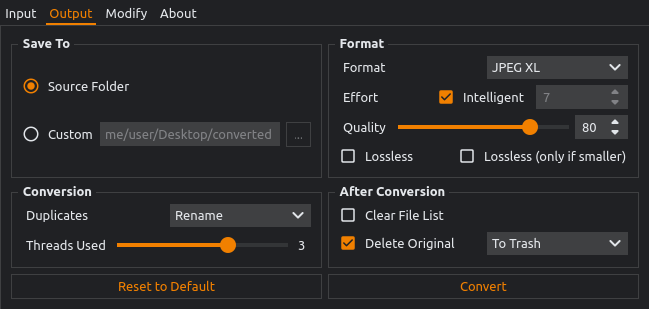
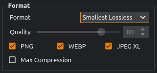

<p align="center">
    
</p>
<h3 align="center">XL Converter</h3>

Powerful image converter for the latest formats with support for multithreading, drag 'n drop, and downscaling.

Available for both Windows and Linux.



## Support This Project

- [Patreon](https://patreon.com/codepoems) - get rewards
- [Ko-Fi](https://ko-fi.com/codepoems) - one-time donation
- [Libera](https://liberapay.com/CodePoems/donate)

## Knowledge-base

Hosted [here](https://xl-converter-docs.codepoems.eu)

Easy to digest documentation with tutorials.

## Supported Formats

Encode to **JPEG XL, AVIF, WEBP, and JPG**.

More details are in the [documentation](https://xl-converter-docs.codepoems.eu/supported-formats).

## Features
### JPEG XL

#### Intelligent Effort

Optimizes `Effort` for smallest size.

#### JPG Reconstruction

Save space by converting JPG to JPEG XL losslessly. You can always reconstruct the original JPG.

### Technical
#### Multithreading

XL Converter can fully utilize your CPU regardless If an encoder does multithreading well.

This speeds up conversion by a lot, especially for JPEG XL.

#### Image Proxy

Avoid picky encoders. A proxy is generated when an encoder doesn't support a format.

For example, this enables HEIF -> JPEG XL conversion.

### General
#### Downscaling

Scale down your images to resolution, percent, shortest (and longest) side or file size.

#### Lossless (Only If Smaller)

Picks the smallest out of two.

#### Smallest Lossless

Utilize multiple formats to get the smallest file size.



## Running and Building

### Windows 10

Install Python `3.11.6` from [here](https://www.python.org/downloads).

Check `Add Python to environment variables` and `pip` as option features.

Download and enter the repo.

```cmd
cd xl-converter
```

Setup `venv`.

```cmd
python -m venv env
env\Scripts\activate.bat
pip install -r requirements.txt
```

Install redistributables

```cmd
misc\VC_redist.x64.exe
```

Run the application

```cmd
python main.py
```

You can also build it.

```cmd
python build.py
```

### Linux (Ubuntu-based)

Install packages.

```bash
sudo apt update
sudo apt install python3 python3-pip python3-venv git
sudo apt install '^libxcb.*-dev' libx11-xcb-dev libglu1-mesa-dev libxrender-dev libxi-dev libxkbcommon-dev libxkbcommon-x11-dev
```

Clone and set up repo.

```bash
git clone https://github.com/JacobDev1/xl-converter.git
chmod -R 755 xl-converter
cd xl-converter
```

Create and activate a virtual environment.

```bash
python3 -m venv env
source env/bin/activate
```

Install Python dependencies

```bash
pip install -r requirements.txt
```

Now, you can run it.

```bash
make run
```

...or build it.

```bash
make build
```

Extra building modes:
- `make build-7z` - package to a 7z file (with an installer) (requires `p7zip-full`)
- `make build-appimage` - package as an AppImage (requires `fuse`)

### Troubleshooting Build Issues

#### Building on Linux

The build may not be generated successfully, because `PyInstaller` sometimes clashes with virtual environments on Linux.

If the executable doesn't launch do the following.

Deactivate the virtual environment.

```bash
deactivate
```

Install packages globally.
```bash
pip install -r requirements.txt
```

Try again.

```bash
make build
```

#### Python Version on Linux

The project runs on Python `3.11.6`. The one in your repo should work, but If it doesn't use `pyenv` to get this one specifically. 

## Bug Reports

You can submit a bug report in 2 ways
- \[public\] Submit a new [GitHub Issue](https://github.com/JacobDev1/xl-converter/issues)
- \[private\] Email me at contact@codepoems.eu

## Contributions

Pull requests are ignored to avoid potential legal complications when reusing the code.

Forward your code and feature suggestions to my email at contact@codepoems.eu